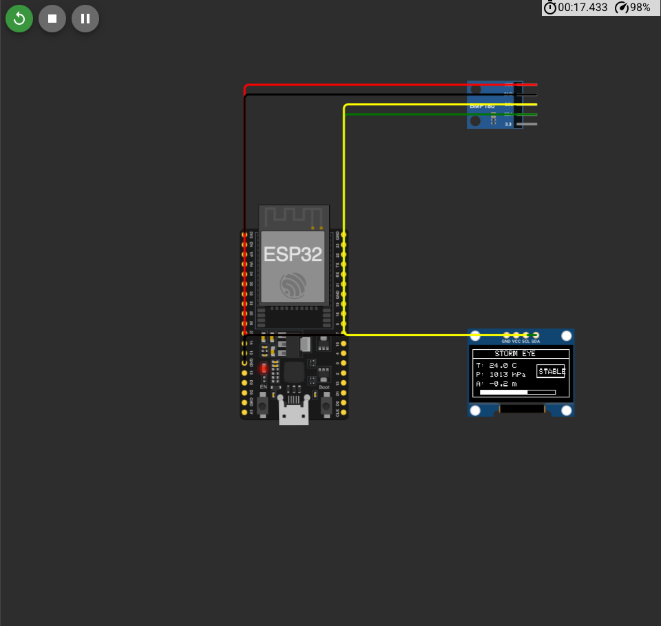

# altitude-bmp180 (StormEye - ESP32 Atmospheric Monitoring System)

**StormEye** is a smart atmospheric monitoring system built using an **ESP32**, **BMP180 Barometric Pressure Sensor**, and **SSD1306 OLED Display**. It continuously monitors **temperature, atmospheric pressure, and altitude**, while also providing a **basic weather prediction system** based on pressure changes.

Designed as a lightweight embedded weather intelligence project, StormEye visualizes live environmental data directly on an OLED display and demonstrates how environmental sensing can be integrated into compact embedded systems.

---

## Demo



---

## Features

- Real-time **Temperature Monitoring**
- Live **Atmospheric Pressure Detection**
- **Altitude Estimation**
- Basic **Weather Forecasting Logic**
  - `RAIN` → Falling pressure
  - `CLEAR` → Rising pressure
  - `STABLE` → Minimal pressure variation
- Clean **OLED Dashboard UI**
- Pressure **Progress Bar Visualization**
- Real-time Serial Monitor Output
- Compatible with **ESP32 + BMP180**
- Works in **Wokwi Simulation** and **Physical Hardware**

---

## Hardware Used

| Component | Description |
|-----------|-------------|
| ESP32 Dev Board | Main microcontroller |
| BMP180 Sensor | Measures atmospheric pressure and temperature |
| SSD1306 OLED Display | Displays sensor data visually |
| Jumper Wires | Circuit connections |
| Breadboard (Optional) | Prototyping |

---

## Circuit Connections

### BMP180 → ESP32

| BMP180 | ESP32 |
|--------|-------|
| VCC | 3.3V |
| GND | GND |
| SDA | GPIO 21 |
| SCL | GPIO 22 |

### SSD1306 OLED → ESP32

| OLED | ESP32 |
|------|-------|
| VCC | 3.3V |
| GND | GND |
| SDA | GPIO 21 |
| SCL | GPIO 22 |

Both devices use the **I2C communication protocol** and share the same SDA and SCL lines.

---

## Libraries Used

- `Adafruit BMP085 Library`
- `Adafruit SSD1306`
- `Adafruit GFX`
- `Wire.h`

---

## How It Works

StormEye continuously reads atmospheric data from the **BMP180 sensor**.

The system measures:

- **Temperature (°C)**
- **Pressure (hPa)**
- **Altitude (meters)**

The weather prediction mechanism compares the current pressure with the previous reading.

### Forecast Logic

#### Rain Prediction

If atmospheric pressure decreases noticeably:

```text
Current Pressure < Previous Pressure
```

The system predicts:

```text
RAIN
```

#### Clear Weather

If atmospheric pressure rises:

```text
Current Pressure > Previous Pressure
```

The system predicts:

```text
CLEAR
```

#### Stable Conditions

When pressure remains relatively constant:

```text
STABLE
```

This is a lightweight atmospheric trend detection system intended for experimentation and learning purposes.

Because even the atmosphere leaves warning signs before becoming chaotic. Humans usually skip that feature.

---

## OLED Dashboard

The OLED display provides:

- Temperature Reading
- Pressure Reading
- Altitude Estimation
- Forecast Status
- Visual Pressure Bar
- Minimal Real-Time UI

---

## Serial Monitor Output

```text
===== STORM EYE =====
Temp: 24.5 C
Pressure: 1013 hPa
Altitude: 112.4 m
Forecast: STABLE
```

---

## Wokwi Simulation Support

The project works with **Wokwi Simulator**.

You can dynamically change:

- Temperature
- Pressure

Simply click the **BMP180 sensor** inside Wokwi and adjust the sensor sliders to simulate atmospheric changes.

---

## Future Improvements

Potential upgrades for StormEye:

- WiFi-based Dashboard
- Cloud Data Logging
- Historical Weather Graphs
- Telegram Notifications
- AI Weather Trend Analysis
- Mobile Application Support
- Multi-Sensor Weather Station

---

## Project Structure

```text
StormEye/
│── StormEye.ino
│── README.md
│── demo.png
```

---

## Applications

StormEye can be useful for:

- Smart Weather Monitoring
- IoT Learning Projects
- STEM Education
- Environmental Monitoring
- DIY Weather Stations
- Embedded Systems Learning

---

## Project By

**Hariom Sharnam**  
